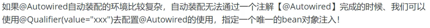
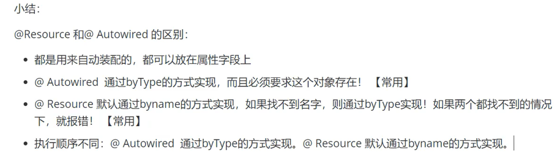

## Autowired ByName
     <bean id="person" class="com.ming.pojo.Person" autowire="byName">
        <property name="name" value="Mingyue"></property>
     </bean>   

## Autowired ByType
        <bean id="person" class="com.ming.pojo.Person" autowire="byType">
        <property name="name" value="Mingyue"></property>
     </bean>

## Annotation config
重点：<context:annotation-config/>
```<?xml version="1.0" encoding="UTF-8"?>
<beans xmlns="http://www.springframework.org/schema/beans"
	xmlns:xsi="http://www.w3.org/2001/XMLSchema-instance"
	xmlns:context="http://www.springframework.org/schema/context"
	xsi:schemaLocation="http://www.springframework.org/schema/beans
		https://www.springframework.org/schema/beans/spring-beans.xsd
		http://www.springframework.org/schema/context
		https://www.springframework.org/schema/context/spring-context.xsd">

	<context:annotation-config/>

</beans>   
```
## Annotation - @Autowired @Resource
]

```public class Person {
    private String name;
    @Resource
    private Dog dog;
    @Autowired
    @Qualifier(value = "cat1")
    private Cat cat;
    }
```
@Resource dependency
```
<dependency>
        <groupId>jakarta.annotation</groupId>
        <artifactId>jakarta.annotation-api</artifactId>
        <version>2.1.1</version>
    </dependency>
```
]